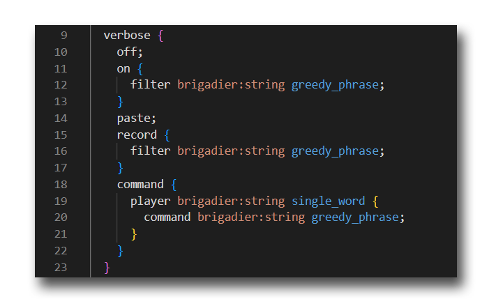

# Commodore Brigadier Markup VSCode extension

An extension for Visual Studio code adding support for lucko's [`.commodore` file format](https://github.com/lucko/commodore-file).

This is used by the [commodore](https://github.com/lucko/commodore) library to provide syntax completions for Bukkit Minecraft plugins.